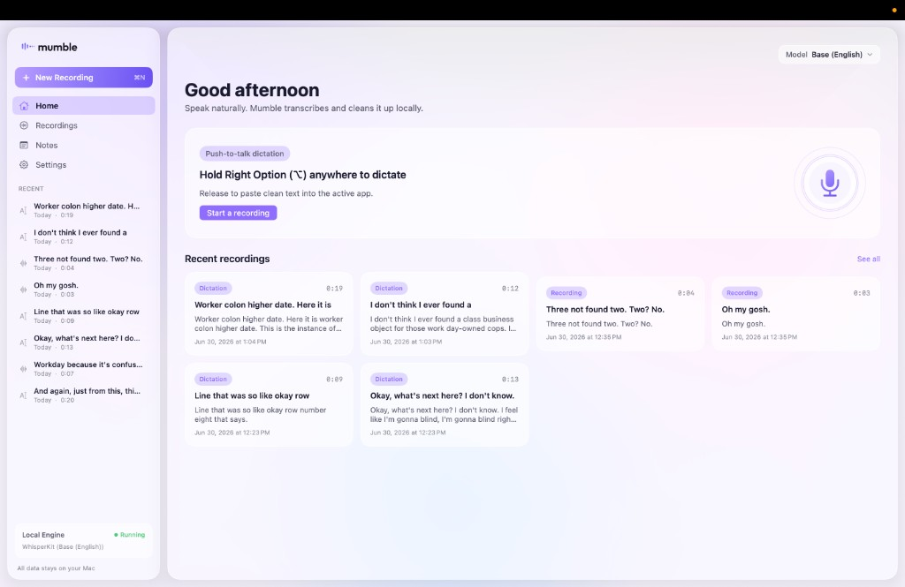
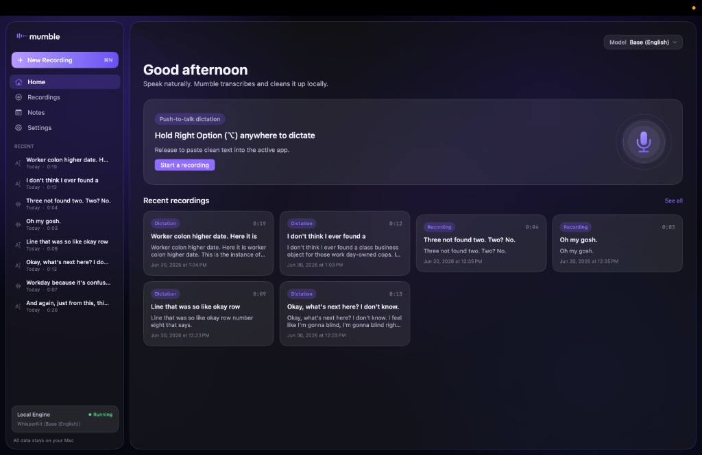

# Mumble

A local-first macOS app for voice transcription and dictation. Everything runs on your Mac — no account, no cloud, no audio ever leaves your device. Speech recognition uses [Parakeet TDT](https://github.com/FluidInference/FluidAudio) (fast, word-timed) or [WhisperKit](https://github.com/argmaxinc/argmax-oss-swift) (multilingual fallback). Optional on-device intelligence resolves self-corrections, voice commands, and style-aware cleanup via Apple Foundation Models (macOS 26+) with a deterministic fallback when AI is off or unavailable.

<p align="center">
  
  
</p>

## What it does

Mumble combines two workflows in one app:

**1. Push-to-talk dictation** — Hold **Right Option (⌥)** anywhere on your Mac, speak, and release. Mumble transcribes your speech, cleans it up, and pastes the result into whatever app you're using.

**2. Recording library** — Record from the app window, get a timestamped transcript with synced playback, search your library, and keep notes. Dictations and recordings are saved automatically.

## Quick start

```bash
./scripts/install.sh
```

This builds a Release app, signs it, copies `Mumble.app` to `/Applications`, and launches it. Mumble lives in the menu bar.

On first launch, onboarding walks you through:

1. **Permissions** — Microphone, Accessibility (for pasting), and Input Monitoring (for the global hotkey).
2. **Model download** — **Parakeet TDT v3** (~600 MB) is the recommended default for English/European dictation (fast, word-level timestamps). Whisper models remain available for multilingual use and as a fallback for languages Parakeet does not cover.

After setup, hold **Right Option (⌥)** to dictate, or open the main window from the menu bar to browse recordings.

## Features

| Area | What you get |
| --- | --- |
| **Dictation** | Global push-to-talk with a floating overlay and live captions; paste cleaned text into any app |
| **Recording** | Record orb, live waveform, automatic transcription |
| **Transcripts** | Timestamped segments, waveform scrubbing, tap-to-seek, variable playback speed |
| **ASR engines** | Parakeet TDT v3 (default for European languages, word timings) or WhisperKit (multilingual) |
| **Cleanup** | Filler-word removal, repeated-word collapsing, punctuation normalization, custom dictionary |
| **Intelligence** | Optional on-device interpreter for self-corrections, voice commands (`new paragraph`, `strike that`, etc.), and style presets — falls back to deterministic cleanup on failure |
| **Snippets** | Trigger phrases that expand to longer text before interpretation |
| **Library** | SwiftData storage for recordings, dictations, and notes — all local under `~/Library/Application Support/com.mumble.app/` |
| **Menu bar** | Always available; toggle dictation or open the main window without a Dock icon |
| **Appearance** | Light and dark mode |

Recording AI Commands (Summarize, Action Items, etc.) are in the UI but disabled — reserved for a future phase.

## Using Mumble

### Dictate from anywhere

Hold **Right Option (⌥)** → speak → release. The cleaned text is pasted at your cursor.

You can also click the menu-bar icon and choose **Start / Stop Dictation** for a hands-free toggle.

### Record from the app

Click **New Recording** in the sidebar (or press **⌘N**), speak, and stop when done. Mumble transcribes automatically and adds the recording to your library.

### Change the model

Open **Settings → Models**. Download additional models anytime; each shows its own progress. **Parakeet TDT v3** is recommended for dictation speed and word-level timing; **Large v3 Turbo** is the most accurate Whisper option on Apple Silicon.

### Smart dictation (optional)

Open **Settings → Intelligence** to enable **Smart dictation**. When on, an on-device interpreter resolves self-corrections (`actually…`, `I mean…`), inline voice commands (`new paragraph`, `strike that`, spoken punctuation), and style presets (Formal, Email, Code, Casual). Snippets let you speak a short trigger to insert longer text.

Requires Apple Intelligence (macOS 26+) or a future MLX fallback model. If the interpreter is unavailable, times out, or rejects its own output, Mumble falls back to the existing deterministic cleanup — your pasted text is never corrupted.

## Permissions

| Permission | Why |
| --- | --- |
| **Microphone** | Record audio to transcribe |
| **Accessibility** | Paste dictated text into other apps (synthesized ⌘V) |
| **Input Monitoring** | Detect the global Right Option hotkey |

Manage these in **Settings → Permissions** or System Settings → Privacy & Security.

> Grants are tied to the signed binary at a specific path. If you rebuild or move the app, you may need to re-grant Accessibility and Input Monitoring.

## Build from source

Requires macOS 14+, Xcode 16+, and [XcodeGen](https://github.com/yonaskolb/XcodeGen) (`brew install xcodegen`). The Xcode project is generated from [`project.yml`](project.yml) and is not committed.

```bash
xcodegen generate
open Mumble.xcodeproj   # then Cmd+R
```

Or build from the command line:

```bash
xcodebuild -project Mumble.xcodeproj -scheme Mumble \
  -configuration Debug -destination 'platform=macOS' \
  CODE_SIGN_IDENTITY="-" build
```

If `xcodebuild` can't find Xcode:

```bash
sudo xcode-select -s /Applications/Xcode.app/Contents/Developer
```

## Why it's not sandboxed

Pasting into arbitrary apps uses `CGEvent.post` to synthesize ⌘V, which App Sandbox blocks with no workaround. Mumble ships non-sandboxed (Hardened Runtime; Developer ID + notarization for distribution). This is standard for dictation utilities and rules out Mac App Store distribution.

## Project structure

```
Mumble/
├─ App/            Entry point, delegate, environment, menu bar
├─ Dictation/      Push-to-talk controller + floating overlay
├─ Audio/          Recording pipeline, waveform analysis
├─ Transcription/  Parakeet + WhisperKit engines, model manager
├─ Interpret/      On-device interpreter (Foundation Models + MLX fallback)
├─ Snippets/       Voice trigger → expansion
├─ Styles/         Style presets and per-app routing
├─ Polish/         Text cleanup (fillers, punctuation, dictionary)
├─ Output/         Clipboard + paste
├─ Storage/        SwiftData models, settings, paths
├─ Permissions/    Microphone, Accessibility, Input Monitoring
└─ UI/             Home, Recordings, Notes, Settings
```

## Roadmap

- MLX interpreter fallback for macOS without Apple Intelligence
- Recording AI Commands (Summarize, Action Items, Decisions, Notes)
- Apple Speech engine behind `TranscriptionEngine`
- Signed + notarized releases and Sparkle auto-update

## License

Source-available for personal use. WhisperKit retains its own license.
